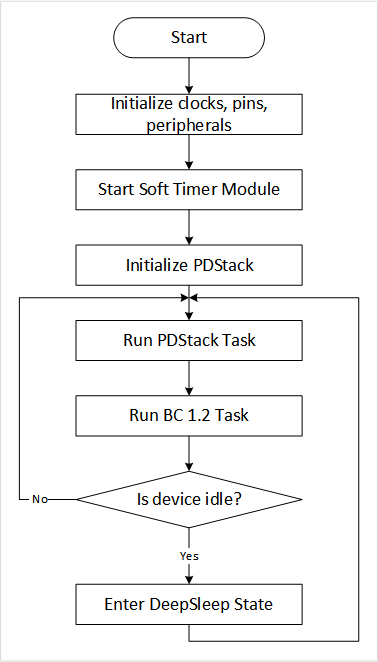
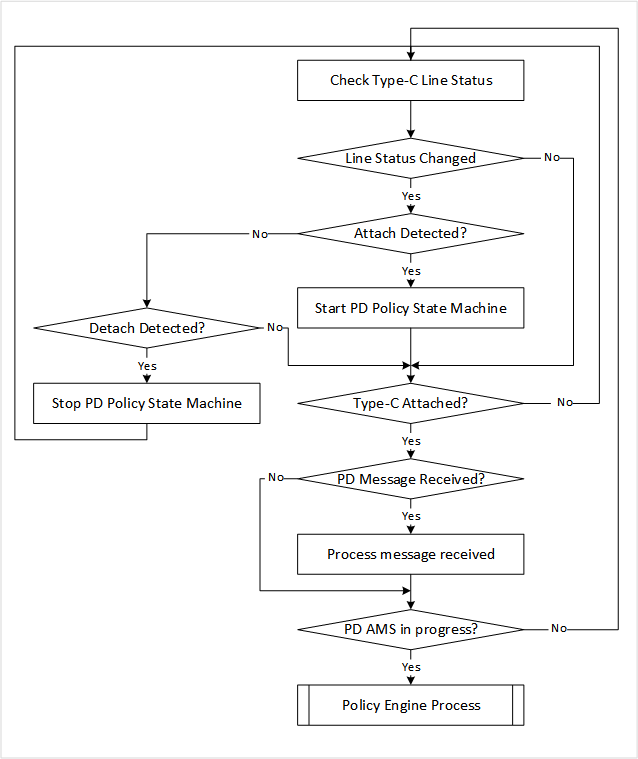
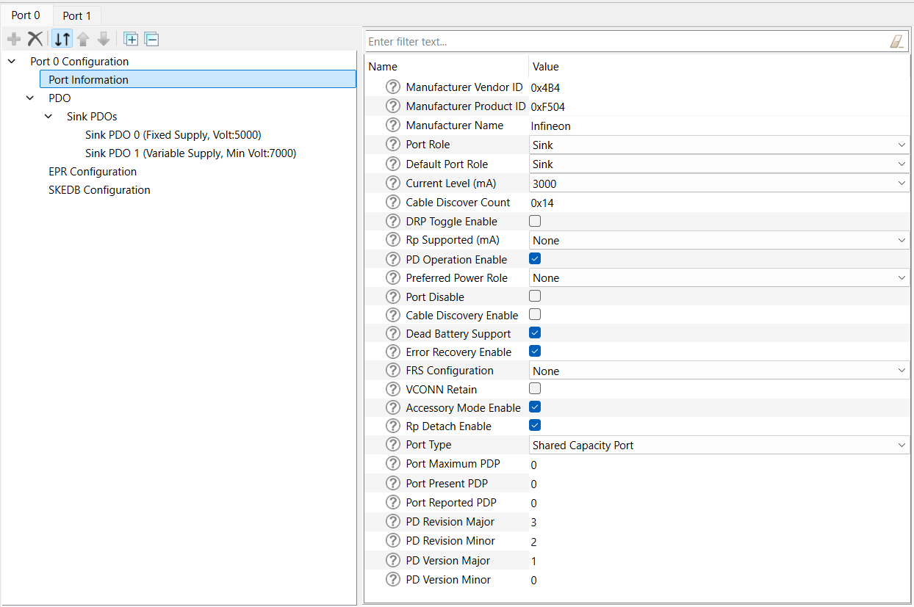
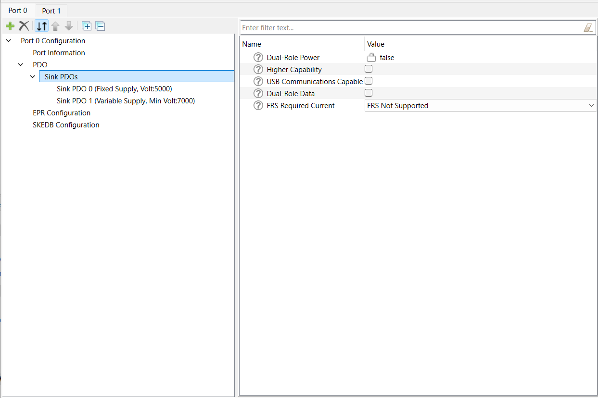
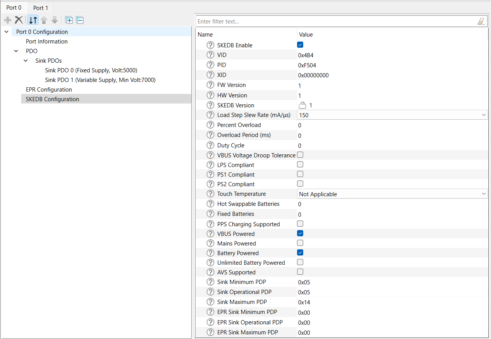

# USBPD Sink

This code example demonstrates USB-C attach detection and USB Power Delivery contract negotiation using PMG1 devices.

## Requirements

- [ModusToolbox software](https://www.cypress.com/products/modustoolbox-software-environment) v2.3 or later

  **Note:** This code example version requires ModusToolbox software version 2.3 or later and is not backward compatible with v2.2 or older versions.

- Board Support Package (BSP) minimum required version: 1.0.0
- Programming Language: C
- Associated Parts: All [PMG1](http://www.cypress.com/PMG1) parts

## Supported Toolchains (make variable 'TOOLCHAIN')

- GNU Arm® Embedded Compiler v9.3.1 (`GCC_ARM`) - Default value of `TOOLCHAIN`
- Arm compiler v6.13 (`ARM`)
- IAR C/C++ compiler v8.42.2 (`IAR`)

## Supported Kits (make variable 'TARGET')

- [PMG1-S0 Prototyping Kit](http://www.cypress.com/CY7110) (`PMG1-CY7110`) - Default target
- [PMG1-S1 Prototyping Kit](http://www.cypress.com/CY7111) (`PMG1-CY7111`)
- [PMG1-S2 Prototyping Kit](http://www.cypress.com/CY7112) (`PMG1-CY7112`)

## Hardware Setup

This example uses the board's default configuration. See the kit user guide to ensure that the board is configured correctly.

The USB-C port on the board should be connected to a USB Type-C or USBPD-enabled power adapter for operation.

## Software Setup

This example requires no additional software or tools.

## Using the Code Example

Create the project and open it using one of the following:

<details><summary><b>In Eclipse IDE for ModusToolbox</b></summary>

1. Click the **New Application** link in the **Quick Panel** (or, use **File** > **New** > **ModusToolbox Application**). This launches the [Project Creator](http://www.cypress.com/ModusToolboxProjectCreator) tool.

2. Pick a kit supported by the code example from the list shown in the **Project Creator - Choose Board Support Package (BSP)** dialog.

   When you select a supported kit, the example is reconfigured automatically to work with the kit. To work with a different supported kit later, use the [Library Manager](https://www.cypress.com/ModusToolboxLibraryManager) to choose the BSP for the supported kit. You can use the Library Manager to select or update the BSP and firmware libraries used in this application. To access the Library Manager, click the link from the **Quick Panel**.

   You can also just start the application creation process again and select a different kit.

   If you want to use the application for a kit not listed here, you may need to update the source files. If the kit does not have the required resources, the application may not work.

3. In the **Project Creator - Select Application** dialog, choose the example by enabling the checkbox.

4. Optionally, change the suggested **New Application Name**.

5. Enter the local path in the **Application(s) Root Path** field to indicate where the application needs to be created.

   Applications that can share libraries can be placed in the same root path.

6. Click **Create** to complete the application creation process.

For more details, see the [Eclipse IDE for ModusToolbox User Guide](https://www.cypress.com/MTBEclipseIDEUserGuide) (locally available at *{ModusToolbox install directory}/ide_{version}/docs/mt_ide_user_guide.pdf*).

</details>

<details><summary><b>In Command-line Interface (CLI)</b></summary>

ModusToolbox provides the Project Creator as both a GUI tool and a command line tool to easily create one or more ModusToolbox applications. See the "Project Creator Tools" section of the [ModusToolbox User Guide](https://www.cypress.com/ModusToolboxUserGuide) for more details.

Alternatively, you can manually create the application using the following steps:

1. Download and unzip this repository onto your local machine, or clone the repository.

2. Open a CLI terminal and navigate to the application folder.

   On Linux and macOS, you can use any terminal application. On Windows, open the **modus-shell** app from the Start menu.

   **Note:** The cloned application contains a default BSP file (*TARGET_xxx.mtb*) in the *deps* folder. Use the [Library Manager](https://www.cypress.com/ModusToolboxLibraryManager) (`make modlibs` command) to select and download a different BSP file, if required. If the selected kit does not have the required resources or is not [supported](#supported-kits-make-variable-target), the application may not work.

3. Import the required libraries by executing the `make getlibs` command.

Various CLI tools include a `-h` option that prints help information to the terminal screen about that tool. For more details, see the [ModusToolbox User Guide](https://www.cypress.com/ModusToolboxUserGuide) (locally available at *{ModusToolbox install directory}/docs_{version}/mtb_user_guide.pdf*).

</details>

<details><summary><b>In Third-party IDEs</b></summary>

1. Follow the instructions from the **In Command-line Interface (CLI)** section to create the application, and import the libraries using the `make getlibs` command.

2. Export the application to a supported IDE using the `make <ide>` command.

   For a list of supported IDEs and more details, see the "Exporting to IDEs" section of the [ModusToolbox User Guide](https://www.cypress.com/ModusToolboxUserGuide) (locally available at *{ModusToolbox install directory}/docs_{version}/mtb_user_guide.pdf*).

3. Follow the instructions displayed in the terminal to create or import the application as an IDE project.

</details>

## Operation

1. Connect the PMG1 kit to your PC using the provided USB cable through the KitProg3 USB connector.

2. Program the board.

   - **Using Eclipse IDE for ModusToolbox:**

      1. Select the application project in the Project Explorer.

      2. In the **Quick Panel**, scroll down, and click **\<Application Name> Program (KitProg3_MiniProg4)**.

   - **Using CLI:**

     From the terminal, execute the `make program` command to build and program the application using the default toolchain to the default target. You can specify a target and toolchain manually:
      ```
      make program TARGET=<BSP> TOOLCHAIN=<toolchain>
      ```

      Example:
      ```
      make program TARGET=PMG1-CY7110 TOOLCHAIN=GCC_ARM
      ```

3. After programming, connect the USB Type-C connector (J9) on the kit to a USBPD source device via the USB Type-C to Type-C cable. The User LED (LED3) on the board will blink at different rates depending on the type of power adapter connected:

   - If a power adapter supporting USB Power Delivery is connected, the LED blinks at about 5 Hz (toggles every 100 ms).
   - If a USB Type-C power adapter or a Standard Downstream Port (SDP) is connected, the LED blinks at about 1 Hz (toggles every 500 ms).
   - If a Downstream Charging Port (DCP) is connected, the LED blinks at about 0.17 Hz (toggles every 3 seconds).
   - If a Charging Downstream Port (CDP) is connected, the LED blinks at about 0.05 Hz (toggles every 10 seconds).

## Debugging

You can debug the example to step through the code. In the IDE, use the **\<Application Name> Debug (KitProg3_MiniProg4)** configuration in the **Quick Panel**. For more details, see the "Program and Debug" section in the [Eclipse IDE for ModusToolbox User Guide](https://www.cypress.com/MTBEclipseIDEUserGuide).

## Design and Implementation

The PMG1 devices support a USBPD block which integrates the Type-C terminations, comparators, and the Power Delivery Transceiver required to detect the attachment of a partner device and negotiate power contracts with it.

On reset, the USBPD block is initialized with the following settings:

   - The receiver clock input of the block is connected to a 12 MHz PERI-derived clock.
   - The transmitter clock input of the block is connected to a 600 kHz PERI-derived clock.
   - The SAR ADC clock input of the block is connected to a 1 MHz PERI-derived clock.
   - The SAR ADC in the USBPD block is configured to measure the VBUS_TYPE-C voltage through an internal divider.

The PDStack middleware library implements state machines defined in the **Universal Serial Bus Type-C Cable and Connector Specification** and the **Universal Serial Bus Power Delivery Specification**. This application uses the PDStack in an UFP (Upstream Facing Port) - Sink configuration. PMG1 devices have a dead-battery Rd termination which ensures that a USB-C source/charger connected to it can detect the presence of a sink even when the PMG1 device is not powered.

**Figure 1. Firmware Flowchart**



The PDStack configures the USBPD block on the PMG1 device to detect Type-C connection state changes and USBPD messages, and notify the stack through callback functions. The callback function registers pending tasks which are then handled by the PDStack through the `Cy_PdStack_Dpm_Task` function, which is expected to be called at appropriate times from the main processing loop of the application.

**Figure 2. PDStack Task Flowchart**



The PDStack library uses a set of callbacks registered by the application to perform board-specific tasks such as turning the consumer power path ON/OFF and identifying the optimal source power profile to be used for charging. In this examples, these functions are implemented using the appropriate APIs provided as part of the Peripheral Driver Library (PDL).

The stack also provides notification of various connection and PD policy state changes, so that the rest of the system can be configured as required. These events are used by the example application to implement a separate USB Battery Charging 1.2 Sink state machine, which distinguishes between a Standard Downstream Port (SDP), Charging Downstream Port (CDP), and Downstream Charging Port (DCP). The BC 1.2 Sink state machine is activated only when the power source connected does not support USB Power Delivery. The GPIO connected to LED3 on the board is toggled at different rates to indicate the type of power source which is detected by the PDStack and the BC 1.2 Sink state machine.

The application tries to keep the PMG1 device in **deep sleep** where all clocks are disabled and only limited hardware blocks are enabled, for most of its working time. Interrupts in the USBPD block are configured to detect any changes that happen while the device is in sleep and wake it up for further processing.

An Over-Voltage (OV) comparator in the USBPD block is used to detect cases where the power source is supplying incorrect voltage levels and automatically shut down the power switches to protect the rest of the components on the board.

### Compile-time Configurations

The PMG1 USBPD Sink application functionality can be customized through a set of compile-time parameters which can be turned ON/OFF through the *config.h* header file.

| Macro Name          | Description                           | Allowed values |
| :------------------ | :------------------------------------ | :------------- |
| `CY_PD_SINK_ONLY`     | Specifies that the application supports only the USBPD Sink (Consumer) role | Should be set to 1u |
| `NO_OF_TYPEC_PORTS`   | Specifies the number of USB-C ports supported | Should be set to 1u |
| `CY_PD_REV3_ENABLE`   | Enable USBPD Revision 3.0 support | 1u or 0u |
| `PD_PDO_SEL_ALGO`     | Specifies the algorithm to be used while selecting the best Source Capability to power the board | 0u, 1u, 2u or 3u |
| `VBUS_FET_CTRL`       | Selects the gate driver to be used to turn the consumer power path ON (applicable only in case of CY7110) | 0u or 1u |
| `BATTERY_CHARGING_ENABLE` | Enables BC 1.2 (CDP/DCP) detection when connected to a non-USBPD power source | 1u or 0u |
| `SNK_STANDBY_FET_SHUTDOWN_ENABLE` | Specifies whether the consumer power path should be disabled while PD contracts are being negotiated | 1u or 0u |
| `SYS_DEEPSLEEP_ENABLE` | Enables device entry into deep sleep mode for power saving when the CPU is idle | 1u or 0u |
| `APP_FW_LED_ENABLE` | Enables toggling of User LED (LED3) based on type of power source | 1u or 0u |

### PDStack Library Configuration

The USB Type-C connection manager, USB Power Delivery (USBPD) protocol layer, and USBPD Device Policy Engine state machine implementations are provided in the form of pre-compiled libraries as part of the PDStack middleWare library.

Multiple variants of the PDStack library with different feature sets are provided; you can choose the appropriate version based on the features required by the target application.

   - PMG1_PD3_SNK_LITE: Library with support for USB Type-C sink operation and USBPD Revision 3.0 messaging.
   - PMG1_PD2_SNK_LITE: Library with support for USB Type-C sink operation and USBPD Revision 2.0 messaging. Using this library will reduce the flash (code) memory usage by the application.

The library of choice can be selected by editing the **Makefile** in the application folder and changing the value of the `COMPONENTS` variable. To use the PD revision 2.0 library, replace the `PMG1_PD3_SNK_LITE` reference with `PMG1_PD2_SNK_LITE`.

The properties of the USB-C port including port role and the default response to various USBPD messages can be configured using the EZ-PD Configurator utility. Click on the **EZ-PD Configurator 1.0** item under **Tools** in the Quick Panel to launch the configurator.

**Figure 3. USB-C Port Configuration using EZ-PD Configurator**



Properties of the USB-C port are configured using the **Port Information** section. Because this application supports only USBPD Sink operation, the **Port Role** must be set as **Sink** and **DRP Toggle** must be disabled. Other parameters such as **Manufacturer Vendor ID** and **Manufacturer Product ID** can be set to desired values.

The **Source PDO** and **SCEDB Configuration** sections are not applicable for this application because only Sink operation is supported.

**Figure 4. Sink Capability configuration using EZ-PD Configurator**



The power capabilities supported by the application in the Sink role are specified using the **Sink PDO** section. See the Universal Serial Bus Power Delivery Specification for details on how to encode the various sink capabilities. A maximum of seven PDOs can be added using the configurator.

**Figure 5. Extended Sink Capability configuration using EZ-PD Configurator**



The **SKEDB** section is used to input the Extended Sink Capabilities response that will be sent by the application when queried by the power source. See the Power Delivery Specification for details on the Extended Sink Capabilities format.

Once the parameters have been updated as desired, save the configuration and build the application.

For quick verification of the application configurability, the **PD Operation** parameter under **Port Information** can be disabled. When the PMG1 device is programmed with this modification, you can see that the User LED blinks at a slower rate even when connected to a power source which supports USB Power Delivery.

### Resources and Settings

**Table 1. Application Resources**

| Resource  | Alias/Object   | Purpose                               |
| :-------  | :------------  | :------------------------------------ |
| USBPD     | PD_PORT0       | USBPD block used for PD Communication |
| LED (BSP) | CYBSP_USER_LED | User LED to indicate connection state |

## Related Resources

| Application Notes                                            |                                                              |
| :----------------------------------------------------------- | :----------------------------------------------------------- |
| [AN232553](https://www.cypress.com/documentation/application-notes/an232553) - Getting Started with PMG1 MCU on ModusToolbox | Describes PMG1 MCU devices and how to build your first application with ModusToolbox |
| [AN232565](https://www.cypress.com/documentation/application-notes/an232565) - EZ-PD PMG1 Hardware Design Guidelines and Checklist | Describes hardware design and PCB layout guidelines for PMG1 MCU devices |
| **Code Examples**                                            |                                                              |
| [Using ModusToolbox](https://github.com/cypresssemiconductorco/Code-Examples-for-ModusToolbox-Software)                     | 
| **Device Documentation**                                     |                                                              |
| [PMG1 MCU Datasheets](https://www.cypress.com/PMG1DS)                                                                       |
| **Development Kits**                                         | Buy at www.cypress.com                                       |
| [CY7110](http://www.cypress.com/CY7110) PMG1-S0 Prototyping Kit | [CY7111](http://www.cypress.com/CY7111) PMG1-S1 Prototyping Kit |
 [CY7112](http://www.cypress.com/CY7112) PMG1-S2 Prototyping Kit|
| **Libraries**                                                 |                                                              |
| MTB CAT2 Peripheral Driver Library (PDL) and docs  | [mtb-pdl-cat2](https://github.com/cypresssemiconductorco/mtb-pdl-cat2) on GitHub |
| Cypress Hardware Abstraction Layer (HAL) Library and docs     | [mtb-hal-cat2](https://github.com/cypresssemiconductorco/mtb-hal-cat2) on GitHub |
| **Middleware**                                               |                                                              |
| Cypress PDStack Middleware Library and docs | [pdstack](https://github.com/cypresssemiconductorco/pdstack) on GitHub |
| **Tools**                                                    |                                                              |
| [Eclipse IDE for ModusToolbox](https://www.cypress.com/modustoolbox)     | The cross-platform, Eclipse-based IDE for IoT designers that supports application configuration and development targeting converged MCU and wireless systems.             |

## Other Resources

Cypress provides a wealth of data at www.cypress.com to help you select the right device, and quickly and effectively integrate it into your design.

## Document History

Document Title: *CE231856* - *USBPD Sink*

| Version | Description of Change |
| ------- | --------------------- |
| 1.0.0   | New code example      |
------

All other trademarks or registered trademarks referenced herein are the property of their respective owners.


-------------------------------------------------------------------------------

© Cypress Semiconductor Corporation (An Infineon Technologies Company), 2021. This document is the property of Cypress Semiconductor Corporation and its subsidiaries ("Cypress"). This document, including any software or firmware included or referenced in this document ("Software"), is owned by Cypress under the intellectual property laws and treaties of the United States and other countries worldwide. Cypress reserves all rights under such laws and treaties and does not, except as specifically stated in this paragraph, grant any license under its patents, copyrights, trademarks, or other intellectual property rights. If the Software is not accompanied by a license agreement and you do not otherwise have a written agreement with Cypress governing the use of the Software, then Cypress hereby grants you a personal, non-exclusive, nontransferable license (without the right to sublicense) (1) under its copyright rights in the Software (a) for Software provided in source code form, to modify and reproduce the Software solely for use with Cypress hardware products, only internally within your organization, and (b) to distribute the Software in binary code form externally to end users (either directly or indirectly through resellers and distributors), solely for use on Cypress hardware product units, and (2) under those claims of Cypress's patents that are infringed by the Software (as provided by Cypress, unmodified) to make, use, distribute, and import the Software solely for use with Cypress hardware products. Any other use, reproduction, modification, translation, or compilation of the Software is prohibited.<br />
TO THE EXTENT PERMITTED BY APPLICABLE LAW, CYPRESS MAKES NO WARRANTY OF ANY KIND, EXPRESS OR IMPLIED, WITH REGARD TO THIS DOCUMENT OR ANY SOFTWARE OR ACCOMPANYING HARDWARE, INCLUDING, BUT NOT LIMITED TO, THE IMPLIED WARRANTIES OF MERCHANTABILITY AND FITNESS FOR A PARTICULAR PURPOSE. No computing device can be absolutely secure. Therefore, despite security measures implemented in Cypress hardware or software products, Cypress shall have no liability arising out of any security breach, such as unauthorized access to or use of a Cypress product. CYPRESS DOES NOT REPRESENT, WARRANT, OR GUARANTEE THAT CYPRESS PRODUCTS, OR SYSTEMS CREATED USING CYPRESS PRODUCTS, WILL BE FREE FROM CORRUPTION, ATTACK, VIRUSES, INTERFERENCE, HACKING, DATA LOSS OR THEFT, OR OTHER SECURITY INTRUSION (collectively, "Security Breach"). Cypress disclaims any liability relating to any Security Breach, and you shall and hereby do release Cypress from any claim, damage, or other liability arising from any Security Breach. In addition, the products described in these materials may contain design defects or errors known as errata which may cause the product to deviate from published specifications. To the extent permitted by applicable law, Cypress reserves the right to make changes to this document without further notice. Cypress does not assume any liability arising out of the application or use of any product or circuit described in this document. Any information provided in this document, including any sample design information or programming code, is provided only for reference purposes. It is the responsibility of the user of this document to properly design, program, and test the functionality and safety of any application made of this information and any resulting product. "High-Risk Device" means any device or system whose failure could cause personal injury, death, or property damage. Examples of High-Risk Devices are weapons, nuclear installations, surgical implants, and other medical devices. "Critical Component" means any component of a High-Risk Device whose failure to perform can be reasonably expected to cause, directly or indirectly, the failure of the High-Risk Device, or to affect its safety or effectiveness. Cypress is not liable, in whole or in part, and you shall and hereby do release Cypress from any claim, damage, or other liability arising from any use of a Cypress product as a Critical Component in a High-Risk Device. You shall indemnify and hold Cypress, its directors, officers, employees, agents, affiliates, distributors, and assigns harmless from and against all claims, costs, damages, and expenses, arising out of any claim, including claims for product liability, personal injury or death, or property damage arising from any use of a Cypress product as a Critical Component in a High-Risk Device. Cypress products are not intended or authorized for use as a Critical Component in any High-Risk Device except to the limited extent that (i) Cypress's published data sheet for the product explicitly states Cypress has qualified the product for use in a specific High-Risk Device, or (ii) Cypress has given you advance written authorization to use the product as a Critical Component in the specific High-Risk Device and you have signed a separate indemnification agreement.<br />
Cypress, the Cypress logo, Spansion, the Spansion logo, and combinations thereof, WICED, PSoC, CapSense, EZ-USB, F-RAM, and Traveo are trademarks or registered trademarks of Cypress in the United States and other countries. For a more complete list of Cypress trademarks, visit cypress.com. Other names and brands may be claimed as property of their respective owners.
